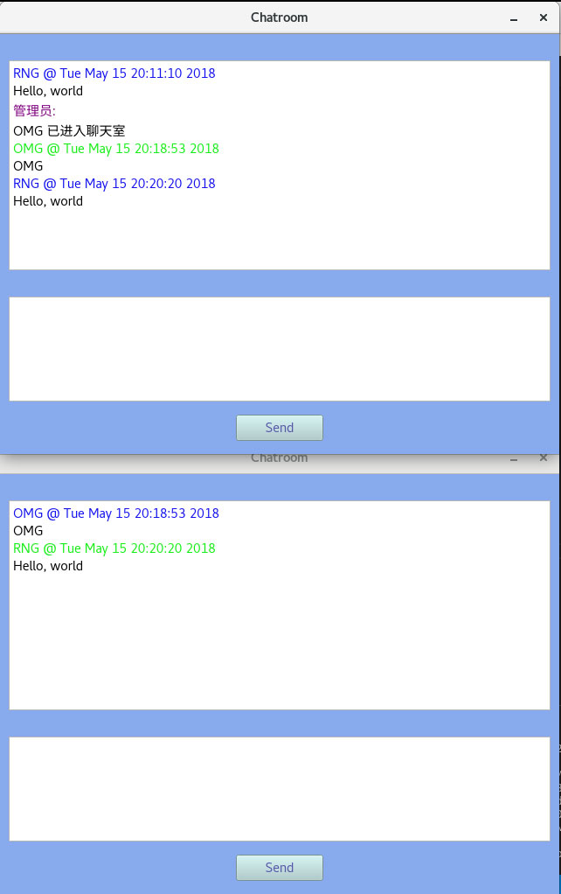
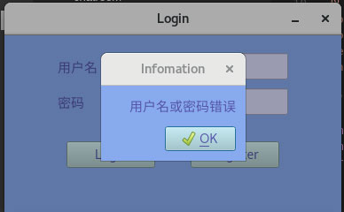

# PyQt5 chatroom Readme

依赖: PyQt5, socket, pymysql

## 目录

- [class Login(QMainWindow)](#Login)
- [class Register(QMainWindow)](#Register)
- [class Chatroom(QMainWindow)](#Chatroom)
- [class Popup(QMessageBox)](#Popup)
- [class CliSoc(QUdpSocket)](#CliSoc)

## Login

## Register

## Chatroom

## Popup

## CliSoc

就是一个套接字类, 无图
